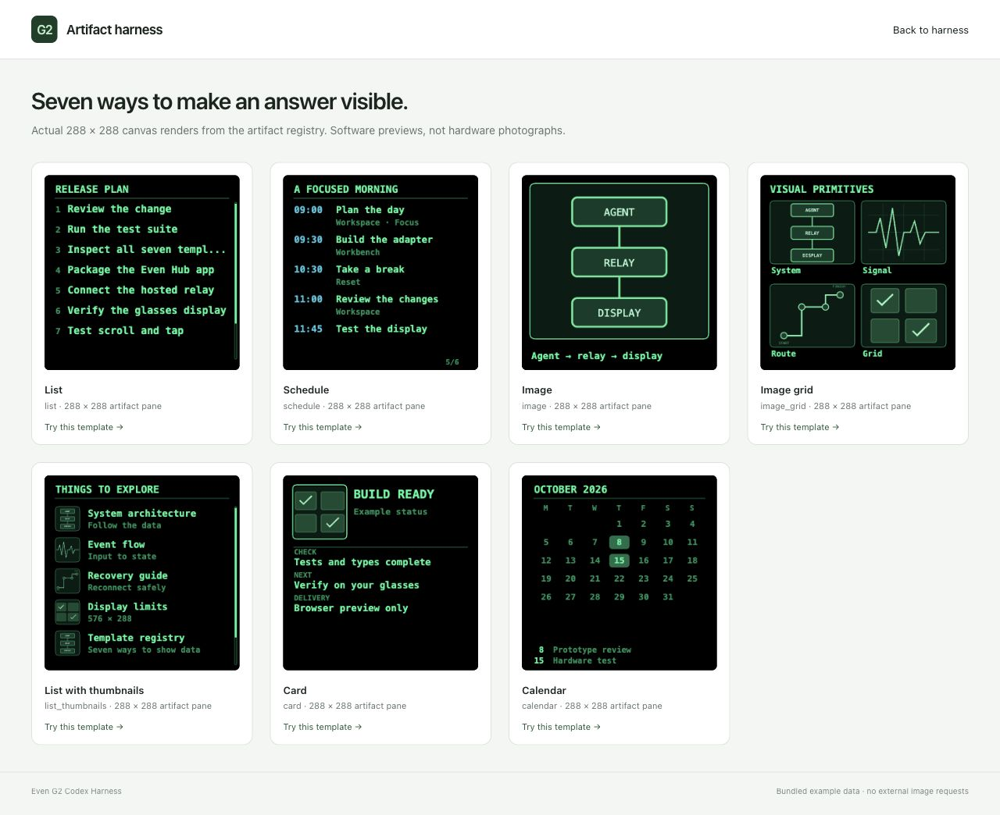

# Even G2 Codex Harness

A standalone, open-source artifact display layer for **Even Realities G2**. Give Codex structured data; keep its answer beside a compact canvas artifact on your glasses.

[](https://github.com/Nikhi-l/even-g2-codex-harness/actions/workflows/ci.yml)
[MIT license](LICENSE) · [Architecture](docs/ARCHITECTURE.md) · [Self-hosting](docs/HOSTING.md) · [Even Hub setup](docs/EVEN_HUB.md) · [Codex connection](docs/CODEX.md)


*Actual browser screenshot of this project. The artifact pixels use the real template renderer; native answer text is approximated. This is a software preview, not a photograph through G2 lenses.*

## What is included

- The original **seven artifact templates**: list, schedule, image, image grid, thumbnail list, card, and calendar.
- A 576 × 288 split surface: native answer text on the left, a 288 × 288 canvas artifact on the right, encoded as two 288 × 144 image tiles.
- Stable page structure, incremental answer updates, changed-artifact rendering, scroll, and open/close layout controls.
- Authenticated **stdio and Streamable HTTP MCP**, strict template schemas, revision checks, expiry, bounded input history, and delivery receipts.
- A no-key browser demo, editable payloads, gallery, real Even Hub SDK adapter, Docker/Caddy hosting recipe, and Even Hub packaging scripts.

This is a single-wearer developer harness. The SDK path is implemented and tested against a mocked bridge. **Real G2 end-to-end verification remains pending.** The phone's Even Hub app owns Bluetooth; a desktop browser cannot pair with G2 through this project. Microphone capture, arbitrary HTML, remote image fetching, and automatic Codex turns are outside this release.

## Run in five minutes

Use **Node 22.12+** (Node 24 recommended) and npm.

```bash
git clone https://github.com/Nikhi-l/even-g2-codex-harness.git
cd even-g2-codex-harness
npm ci
npm run check
npm start
```

Open the private session link printed by `npm start`. It connects this tab to the relay and removes the token from the address bar. State stays in memory. The token is generated locally and saved in the ignored `.local/connection.json` with owner-only permissions.

For a standalone gallery/demo without the relay:

```bash
npm run demo
# Open http://127.0.0.1:5173
```

Choose a template, edit its JSON and answer, then **Show artifact**. Scroll moves the artifact window. Tap toggles the artifact pane. Double tap closes it. In full-width answer mode, scroll pages the answer. **Clear display** blanks both panes; unexpired artifacts can be selected again through MCP.

## Connect Codex

Start the relay, then register the local MCP server from this checkout:

```bash
codex mcp add even-g2 -- node "$(pwd)/dist/server/mcp.js"
codex mcp get even-g2
```

Start/reload a Codex session and ask:

> Use even-g2 to show a list artifact with my next three development tasks. Put a short explanation in the answer pane. Check the delivery status afterward.

The MCP process reads the local connection file. It does not need an OpenAI API key, and its stdout contains only MCP messages. Your Codex installation provides the model and its usual permissions.

For self-hosted use, connect your MCP client to `https://YOUR_DOMAIN/mcp` with the relay bearer token. See [Codex setup](docs/CODEX.md) for the exact command and configuration. Installing this server in a local Codex client does **not** connect a separate cloud chat or desktop “dot” automatically. Input events are available through `display_events`; they do not wake an agent conversation.

## The artifact UX



*Genuine renders from the template registry. The four image assets are bundled diagram fixtures, not personal photos or remote downloads.*

| Template | Data | Behavior |
| --- | --- | --- |
| `list` | Title and string or labeled rows | Scrollable seven-row window |
| `schedule` | Times, titles, locations, tags | Scrollable five-event window |
| `image` | Bundled image key, caption | Single cover image |
| `image_grid` | Two to four image keys and labels | Two-column board |
| `list_thumbnails` | Image keys, primary/secondary labels | Scrollable five-row window |
| `card` | Title, subtitle, optional image, key/value rows | Structured detail card |
| `calendar` | Explicit month and marked days | Monday-first month view |

[Phone screenshot](docs/assets/phone-preview.jpg) · [Template authoring](docs/TEMPLATES.md) · [Source extraction map](docs/PROVENANCE.md)

## Architecture


`Codex → MCP → authenticated relay → validated artifact state → phone renderer → Even Hub SDK → G2`

The same state feeds the browser preview. SDK writes are serialized. A receipt means either **browser-rendered** or **bridge-accepted**; neither is proof that pixels appeared on physical lenses. [Architecture and recovery details](docs/ARCHITECTURE.md) cover the lifecycle, trust boundaries, and extension points.

## Host it and test on G2

1. Host the relay behind HTTPS using [HOSTING.md](docs/HOSTING.md). Use one isolated instance and secret per wearer.
2. Build a package for your actual relay origin and your registered Even Hub package ID:

   ```bash
   npm run package:hosted -- --origin https://glasses.example.com --package-id your.registered.package
   ```

3. Review `.local/app.hosted.json`, install the resulting `.local/even-g2-harness.ehpk` through your Even Hub developer workflow, and enter the relay token at runtime.
4. Connect the glasses in the Even app, launch the harness, and press **Connect Even Hub**.
5. Follow the [end-to-end acceptance checklist](docs/EVEN_HUB.md#end-to-end-acceptance) before claiming hardware support.

The manifest generator embeds only a public relay origin and exact network whitelist. It never bundles your bearer token. No server or Even Hub listing is deployed by these scripts.

## Verify and contribute

```bash
npm run check          # types, lint, unit/integration tests, build, file audit
npm run test:browser   # browser regression suite (install Chromium first)
npm audit
npm run pack:g2        # demo-only Even Hub package; no network permissions
```

The tested baseline is SDK **0.0.14**, CLI **0.1.14**, and Even app **2.2.9+**. npm also offered SDK 0.0.16 during development; it is not silently substituted for this pinned baseline. See [compatibility and limitations](docs/COMPATIBILITY.md), [verification evidence](docs/VERIFICATION.md), [security](SECURITY.md), and [contributing](CONTRIBUTING.md).
