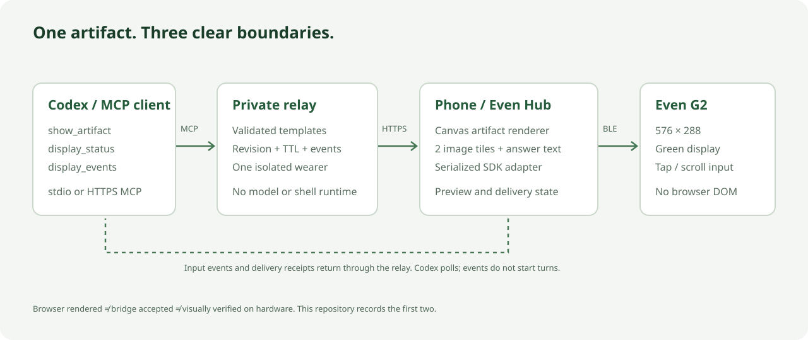

# Architecture

## Boundary and purpose

This project is a reusable artifact actuator for one wearer. Codex supplies structured artifact data over MCP. The relay validates and stores it. The phone renders and applies it through Even Hub. The glasses receive native containers, not arbitrary HTML.



```mermaid
sequenceDiagram
  participant C as Codex MCP client
  participant R as Private relay
  participant S as State store
  participant P as Phone/preview
  participant E as Even Hub SDK
  participant G as G2
  C->>R: show_artifact(artifact, expectedSessionId?, expectedRevision?)
  R->>S: Validate discriminated template schema
  S-->>R: Snapshot + revision + expiry
  R-->>C: Accepted state (not a render promise)
  P->>R: Poll /api/state with bearer token
  R-->>P: Latest snapshot
  P->>P: Draw registered canvas template
  P->>E: Create/rebuild only if layout changes
  P->>E: Native answer update; two sequential image tiles
  E->>G: Native Bluetooth transport
  E-->>P: SDK acceptance result
  P->>R: Receipt(session, revision, mode)
  G->>E: Tap/scroll
  E->>P: textEvent or sysEvent
  P->>R: Normalized input + visible revision
  R->>S: Validate, deduplicate, transition
  C->>R: display_events(after, expectedSessionId?)
  R-->>C: Bounded event journal + cursor
```

## Code ownership

| Module | Responsibility | Must not do |
| --- | --- | --- |
| `src/core/contracts.ts` | Twelve strict template schemas, bounds, capabilities | Import browser or provider runtime |
| `src/core/text.ts` | Measured G2 font advances, pixel wrapping and the ten-line budget | Depend on a browser font |
| `src/core/store.ts` | Artifact lifecycle, revision conflicts, expiry, input journal | Access disk, network, microphone, or shell |
| `src/core/render.ts` | Deterministic answer wrapping, paging, scroll bounds | Call the SDK |
| `src/artifacts/` | Extracted canvas template registry and draw functions | Know about Codex, customers, or relay tokens |
| `src/device/tiles.ts` | Canvas to two bounded PNG tiles; Gray4 prequantization | Fetch arbitrary images |
| `src/device/even.ts` | Actual SDK calls, container layout, incremental writes | Treat acceptance as physical verification |
| `src/device/adapter.ts` | Adapter contract and latest-state serial queue | Overlap writes or retry an unresolved timeout |
| `src/server/http.ts` | Auth, allowed origins/hosts, request bounds, REST/MCP | Serve files outside built web root |
| `src/server/mcp-tools.ts` | MCP schemas and bounded relay calls | Execute model-generated code |
| `src/controller/` | Explicit guarded MCP writes, event observation, synthetic example | Start model turns, treat input as permission, retry uncertain writes |
| `src/claude/` | Claude Code session HUD (hooks) and the choice channel | Approve tools, block a session, or forward another session's choices |
| `src/web/` | Phone console, demo, editor, gallery, opt-in runtime connection | Bundle bearer tokens or persist artifact content |
| `src/device/settings.ts` | Validate optional phone settings against the exact packaged HTTPS origin | Fetch arbitrary origins or store artifact/input history |

## Artifact lifecycle and input

An artifact has a stable `id`, a registered `template`, validated `data`, an answer, and a 10–3600 second TTL. Publishing replaces the same ID, increments its version, selects it, resets scroll, and opens the split layout. At most 20 artifacts remain in memory; callers delete old items when full. No automatic eviction of a currently visible artifact occurs.

Every display transition increments a relay revision. Optional `expectedSessionId` and `expectedRevision` together prevent stale agent writes across state changes and relay restarts. The controller always sends both; omitting them preserves compatibility for older clients but provides no stale-write protection. Inputs and delivery receipts require both the current session UUID and revision. Input IDs are deduplicated in a bounded 256-entry window. A restart gives a new session UUID and empty state; old inputs cannot operate on a new session with a coincidentally equal revision.

Scroll moves one list/schedule/thumbnail row at a time. Other artifact templates remain fixed. Tap toggles split/full-answer layout, except on a split `choices` artifact, where it records a `choice` event (index and artifact version) and marks the option. `navigate()` in `src/core/render.ts` is the one transition function for the local store and the Sites adapter. Browser/REST `back` closes the artifact pane and retains `inputType: back` in the journal. Native G2 double tap is intercepted by the phone adapter and invokes `shutDownPageContainer(1)` after pending SDK operations, requesting the host-owned system exit dialog. That native exit is not a relay navigation event or proof that the host closed the WebView. Full-answer scroll pages wrapped text. These operations never run a tool, shell command, or model turn. `display_events` retains 100 lifecycle/input events, returns the session UUID and optional original `inputType`, and reports cursor truncation. An optional expected-session guard rejects a cursor belonging to another relay lifetime. Observers must refresh/rebaseline after a restart or journal truncation; missing input is never replayed as permission.

Clear blanks the surface while retaining unexpired artifacts. Delete removes an artifact and blanks it if active. Expiration removes content on the relay and the client also checks expiry. Network loss triggers an attempted blank after ten seconds. A suspended phone, disconnected Bluetooth link, or already failed SDK cannot guarantee immediate clearing: close the app/device display manually if needed.

## Surface and rendering

The source implementation's concrete arrangement is retained: answer at x=0 and artifact at x=288. Some predecessor planning prose described the sides differently; the implemented geometry is the reference.

Split mode uses one 288×288 native text container and two 288×144 PNG image containers. Answer-only mode uses one 576×288 native text container. Exactly one text container captures events. IDs/names are fixed and unique, names are under 16 characters, and z-order values are all omitted.

Startup must return `StartUpPageCreateResult.success` (0). An invalid startup result is an error, not evidence of an existing usable surface. Layout changes use `rebuildPageContainer`; switching artifact templates with the same shape does not rebuild. Answer text that grows or keeps its length is rewritten whole from offset 0; shorter text triggers a rebuild. Offset appends and space padding are not used: the simulator replaces the whole text on every upgrade, and padding wraps into hidden lines that make the firmware scroll (see [DISPLAY.md](DISPLAY.md)). Artifact data or scroll changes regenerate the two tiles; answer-only changes skip images.

Every SDK operation is awaited. Rendering, system exit, and phone setting reads/writes share one serialized operation chain. A setting timeout also closes the adapter because the unresolved SDK call cannot be cancelled. A single queue coalesces pending revisions to the latest snapshot. Image results are normalized with the official SDK helpers. A rejected call or eight-second timeout stops the adapter, unsubscribes events, and asks the wearer to reopen Even Hub. Timed-out SDK work cannot be cancelled; automatic overlapping retries would make state unknowable. Reopening establishes a fresh surface.

The template draw functions are deterministic given explicit data, loaded bundled assets, scroll, the chosen option, and the browser's font metrics. The calendar requires an explicit month. Preview fonts and color are approximations of the device. The SDK receives Gray4 PNGs whose levels are compensated for the display response measured in the Even Hub simulator; the browser preview shows the intended look and is not an optical simulator.

## Delivery vocabulary

- **Accepted state**: relay validated and stored the request.
- **Browser-rendered**: preview adapter completed drawing.
- **Bridge-accepted**: all required SDK calls returned success for that revision.
- **Hardware-verified**: a person visually confirmed the physical display in the acceptance run. This is a separate manual evidence record; no API automatically sets it.

Receipts are self-reports from a trusted token holder, not cryptographic device attestations. Stale receipts are rejected. They expire from the snapshot when state changes; the status response includes receipt timestamps and caller IDs.

## Security and hosting

The default binds loopback. LAN/public binding requires an explicit origin, long bearer token, and `G2_HARNESS_ALLOW_LAN=1`. HTTPS terminates at the reverse proxy. REST and MCP share the same authorization boundary; the browser holds the token in memory by default. A packaged phone app can explicitly remember its exact HTTPS relay origin and token through SDK local storage; this is not a hardware keystore. The default checkbox is unchecked, and Forget removes only the stored value while the current session stays connected. Artifact state and input history remain memory-only. Origins and hosts are allowlisted; request bodies are limited to 16 KiB. Images resolve only through bundled aliases. No user file reads, URL proxy, scripts, audio, or provider key are exposed.

Each deployed relay is a single private namespace for one wearer. Multiple HTTP clients holding its token intentionally share that namespace. Deploy a separate container, secret, and hostname for each wearer. This release is not a multi-tenant service or an identity provider. See [HOSTING.md](HOSTING.md).

## ADR-001: Extract a deterministic display layer

**Status:** Accepted. **Date:** 2026-10-04.

The existing seven canvas templates and tiled surface are retained. The private application, audio providers, person data, and deployment history are removed. State is independent of transport; one implementation serves local demo, stdio MCP, and authenticated HTTP MCP. Native SDK writes live only in the phone adapter.

Alternatives considered: directly sending HTML to G2 (unsupported by the official architecture); direct browser Bluetooth (unsupported by this SDK); retaining the monolithic voice application (unnecessary coupling); a hosted multi-tenant account system (too broad for a display harness). The chosen approach is smaller, testable without hardware, and exposes real device limits. It requires a phone Even Hub WebView and explicit physical validation. Automatic input-driven agent turns would require a separately permissioned controller, potentially using Codex app-server; it is not implemented.
