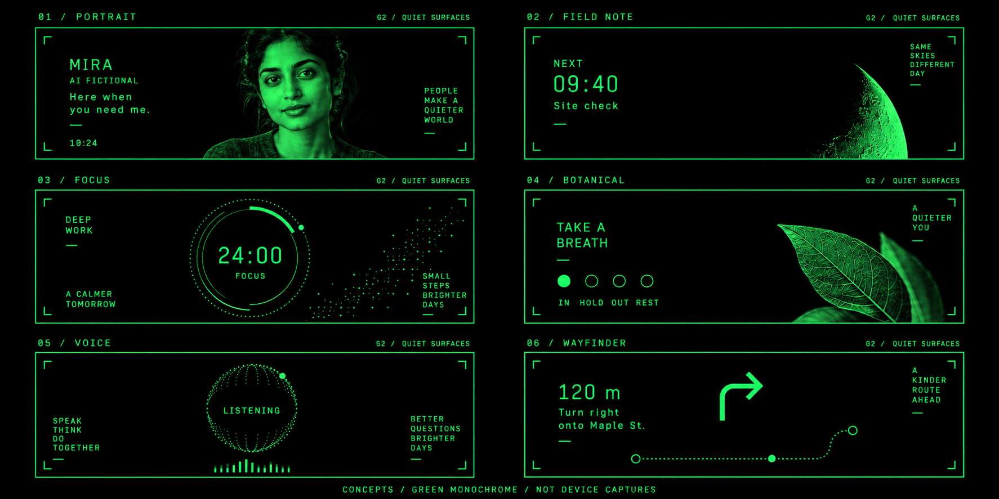
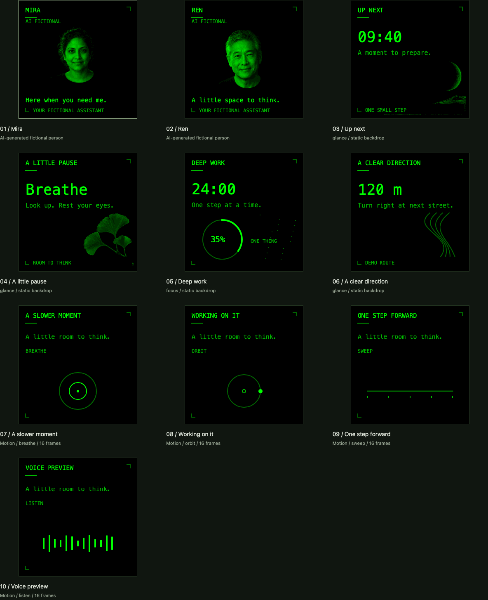

# Quiet Surfaces

Ten example designs across four new templates: `portrait`, `glance`, `focus`, and `motion`. Open `/surfaces.html` after `npm run demo` to explore them. `/gallery.html` and the main artifact editor include all sixteen registered templates. The same schemas are exposed through local and Sites MCP discovery.

This sheet is generated concept art. The implemented layouts use the existing split screen: native answer text on the left and one 288 × 288 artifact pane on the right. These are two content panes within a logical screen, not independently controlled left and right eyes. The six wide compositions above are inspiration, not exact screenshots or lens photographs.

The image above is captured from the running studio, using the real artifact renderer. It is software evidence, not a device capture.

## Display properties checked against Even documentation

Checked 2026-10-11. The [Even Hub overview](https://hub.evenrealities.com/docs/get-started/overview) specifies a 576 × 288 canvas per eye and monochrome green with 16 levels. The [display API](https://hub.evenrealities.com/docs/build/display) limits each image container to 288 × 144 and requires sequential sends. Black pixels emit no light; a black preview background represents the view through the lens, not an opaque black panel. The [design guidelines](https://hub.evenrealities.com/docs/build/design-guidelines) recommend grayscale source art that maps to green on hardware.

The consumer product page quotes different optical specifications; this library targets the **SDK canvas**, which determines our layout. Neither a panel refresh rate nor SDK send pacing establishes achievable full-image animation throughput.

Source photos remain grayscale. The renderer maps every artifact to sixteen intended green intensities, preserving the existing max-channel brightness convention. The device encoder then applies the repository's simulator-derived tone compensation. That mapping still needs physical calibration; it is not a claim that sixteen perceptually distinct shades survive the current bridge/firmware. See [DISPLAY.md](DISPLAY.md).

## Collection

| Template | Variants | Data |
| --- | --- | --- |
| `portrait` | Mira, Ren | `name`, `src`, optional `subtitle`, `note` |
| `glance` | Moonrise, ginkgo, contours | `title`, `value`, optional `detail`, `footer`, `backdrop` |
| `focus` | Star field dial | `title`, `value`, optional `detail`, `progress` from 0 to 1, `backdrop` |
| `motion` | Breathe, orbit, sweep, listening bars | `title`, optional `detail`, `mode`, `phase` from 0 to 15, `backdrop` |

Backdrops: `none`, `moonrise`, `ginkgo`, `contours`, `stars`. The two photographic backgrounds can also be used by the original image templates. Portrait aliases are restricted to `portrait`, whose renderer always prints **AI FICTIONAL**; generic image cards cannot remove that provenance label.

Mira and Ren are fictional, AI-generated people. They are not real contacts or identity/recognition results. Times, directions and focus progress are sample values. Listening bars are decorative and do not indicate microphone capture. Focus values are caller-supplied; there is no hidden running countdown.

## Motion and device use

The four motion modes consist of sixteen deterministic phases. Every moving pixel stays below y=144; the upper tile and all background art remain fixed. The current adapter may still transmit both tiles when artifact data changes, so this does not promise a one-tile transfer optimization.

MCP publication is a single static frame. It does not create a timer or background traffic. To preview movement, select a motion design and press **Play motion** in the studio. **Step frame** advances it manually. The browser player waits for rendering and any device send to finish, then waits at least one second. There is no catch-up queue, no retry after an error, and no automatic playback on connection. A hidden page pauses and does not resume automatically. Reduced-motion mode disables Play while allowing manual stepping.

To try the studio on G2, open its URL through the usual Even Hub sideload workflow, then press **Connect Even Hub**. Connection sends the currently selected still frame. Subsequent device updates require **Also send to Even Hub** to remain checked. Unchecking it stops future sends and leaves the last image on glasses. Use the studio in its own test session: it directly owns a page and does not subscribe to the relay or coordinate with another app already controlling the glasses.

The studio reuses the existing adapter's sequential SDK writes, failure handling and native system exit. A failed/uncancelled SDK operation requires reloading the Even Hub page. A bridge-accepted message is not proof of visible pixels. Test on-device contrast, legibility, bilateral visibility and comfortable cadence before using a design as a persistent background.

## Integration with active work

This collection was developed separately from the active Claude checkout, based on `beea9f1` (`feat/claude-glasses-assistant`). It adds template files, examples, assets and a new Vite entry. It does not replace the voice capture, lab or recovery implementation. If the lab has an uncommitted Vite entry, retain both `lab` and `surfaces` when applying the change. A lab that consumes `examples` and `renderArtifact` discovers these templates through its existing registry path.

Asset provenance and generation briefs are in [QUIET_SURFACES_ASSETS.md](QUIET_SURFACES_ASSETS.md).

## Validation

- TypeScript, ESLint, production Vite build, public-file audit and dependency audit passed locally.
- 57 unit tests and 17 Sites tests passed on the isolated feature branch.
- 22 browser tests passed, including all 16 gallery templates, worst-case clipping, green-only photographic output, 64 motion frames, pause/hidden/reduced-motion behavior, HTTP WebView UUID fallback and sequential SDK sends through a mock native bridge.
- A separate copy containing the active checkout's 13 tracked edits and three new voice/lab files passed its complete check (59 unit tests, 17 Sites tests) and all 22 browser tests with both Vite page entries retained. The SDK test accepts the newer adapter's unchanged-tile optimization, and the QR test checks the common relay instruction rather than the older welcome title.
- Even Hub packaging succeeded (approximately 5 MB `.ehpk`, kept as a local build artifact).
- Generated concept art and real browser captures were visually reviewed. Physical G2 contrast and animation cadence remain unverified for this collection. No running relay or glasses display was changed during validation.
